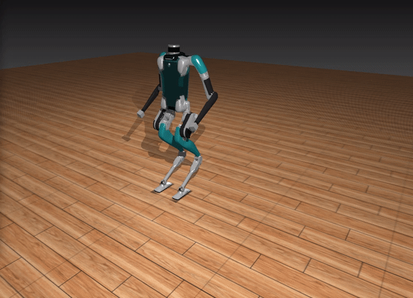

# HumanoidSim.jl

<!--  -->

A Julia package for physics simulation of the Digit humanoid robot. 

This package gives you the option of using either [MuJoCo.jl](https://github.com/adubredu/MuJoCo.jl) or [PyBullet.jl](https://github.com/adubredu/PyBullet.jl) as the backend physics simulator.  

This package uses [MeshCat.jl](https://github.com/rdeits/MeshCat.jl) as the renderer. 

This package is designed to be easily extended to simulate other robots.

## Installation
1. Install anaconda by following the instructions on this [website](https://docs.anaconda.com/anaconda/install/index.html). 
2. Run `echo export JULIA_CONDAPKG_BACKEND="System" > ~/.bashrc` in your terminal.
3. Run `source ~/.bashrc` in your terminal.
4. Open your Julia REPL by typing  `julia` in your terminal.
5. Press `]` on your keyboard to enter the package manager
6. Enter command `add https://github.com/adubredu/MuJoCo.jl` and press 
`Enter` on your keyboard to install the MuJoCo dependency
7. Enter command `add https://github.com/adubredu/HumanoidSim.jl` and press 
`Enter` on your keyboard to install this package.
8. Press the `Backspace` key on your keyboard to return to the REPL

## Usage
See the [examples](examples) folder for usage examples

